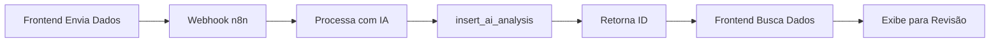

# Guia de Configuração do Supabase - A3 Medical Assistant

## 1. Verificação Inicial

Baseado na análise do código, o sistema espera as seguintes tabelas no Supabase:

### Tabelas Necessárias:
- ✅ **consultations** - Armazena dados das consultas
- ✅ **ai_analysis** - Armazena análises da IA
- ✅ **audio_recordings** - Metadados das gravações de áudio

## 2. Configurações Necessárias

### 2.1 Executar Migration SQL

Execute o arquivo SQL criado em `supabase/migrations/20240101_update_for_webhook_flow.sql` no editor SQL do Supabase:

1. Acesse seu projeto no [Supabase Dashboard](https://app.supabase.com)
2. Vá para **SQL Editor**
3. Cole o conteúdo do arquivo SQL
4. Execute o script

Este script irá:
- ✅ Criar a tabela `ai_analysis` se não existir
- ✅ Adicionar campos necessários na tabela `consultations`
- ✅ Criar índices para melhor performance
- ✅ Configurar políticas RLS (Row Level Security)
- ✅ Criar função `insert_ai_analysis` para o webhook usar
- ✅ Configurar bucket de storage para áudios

### 2.2 Configurar Variáveis de Ambiente

No seu projeto, verifique se as variáveis do Supabase estão configuradas:

```env
VITE_SUPABASE_URL=sua_url_do_supabase
VITE_SUPABASE_ANON_KEY=sua_chave_anonima
```

### 2.3 Configurar o Webhook no n8n

O webhook do n8n deve:

1. **Receber os dados** da consulta com áudio em Base64
2. **Processar com IA** (GPT, Claude, etc.)
3. **Inserir no Supabase** usando a função SQL:

```sql
SELECT insert_ai_analysis(
    'UUID_GERADO',           -- ID único da análise
    'CONSULTATION_ID',       -- ID da consulta recebido
    'HDA processada pela IA',
    'Comorbidades processadas',
    'Medicações processadas',
    'Alergias processadas',
    'Hipótese diagnóstica da IA',
    'Conduta sugerida pela IA'
);
```

4. **Retornar resposta** no formato:
```json
{
  "id": "UUID_GERADO",
  "consultation_id": "CONSULTATION_ID"
}
```

## 3. Teste de Configuração

### Verificar Tabelas:
```sql
-- Verificar se as tabelas existem
SELECT table_name 
FROM information_schema.tables 
WHERE table_schema = 'public' 
AND table_name IN ('consultations', 'ai_analysis', 'audio_recordings');

-- Verificar estrutura da ai_analysis
SELECT column_name, data_type, is_nullable
FROM information_schema.columns
WHERE table_name = 'ai_analysis'
ORDER BY ordinal_position;
```

### Verificar Função:
```sql
-- Testar se a função existe
SELECT routine_name
FROM information_schema.routines
WHERE routine_name = 'insert_ai_analysis';
```

### Verificar RLS:
```sql
-- Verificar se RLS está ativo
SELECT tablename, rowsecurity 
FROM pg_tables 
WHERE schemaname = 'public' 
AND tablename IN ('consultations', 'ai_analysis');
```

## 4. Fluxo de Dados



## 5. Troubleshooting

### Erro: "Tabela não encontrada"
- Execute o script SQL de migração

### Erro: "Permissão negada"
- Verifique políticas RLS
- Confirme que está usando authenticated role

### Erro: "Função não encontrada"
- Re-execute a parte do script que cria a função

### Erro: "Timeout ao buscar dados"
- Verifique se o webhook está inserindo com status 'completed'
- Aumente o tempo de polling se necessário

## 6. Webhook de Exemplo (n8n)

```javascript
// Nó Function do n8n após processar com IA
const analysisId = crypto.randomUUID();
const consultationId = $input.first().json.consultationId;

// Inserir no Supabase
await $supabase.rpc('insert_ai_analysis', {
    p_id: analysisId,
    p_consultation_id: consultationId,
    p_hda_ai: aiResponse.hda,
    p_comorbidades_ai: aiResponse.comorbidades,
    p_medicacoes_ai: aiResponse.medicacoes,
    p_alergias_ai: aiResponse.alergias,
    p_hipotese_diagnostica_ai: aiResponse.hipotese,
    p_conduta_ai: aiResponse.conduta
});

// Retornar resposta esperada
return {
    json: {
        id: analysisId,
        consultation_id: consultationId
    }
};
```

## 7. Próximos Passos

1. Execute o script SQL no Supabase
2. Configure o webhook no n8n conforme exemplo
3. Teste o fluxo completo
4. Monitore os logs no Supabase Dashboard

## Suporte

Em caso de dúvidas:
- Verifique os logs do Supabase em **Logs > API**
- Verifique console do navegador para erros do frontend
- Teste o webhook isoladamente com Postman/Insomnia 